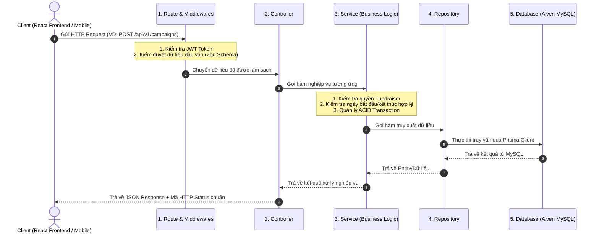

# Dự án Hệ thống Gây quỹ Cộng đồng (  ) - CĐ09

Dự án này sử dụng mô hình kiến trúc **Modular Monolith** kết hợp MVC cho Backend và cấu trúc phân rã theo Component cho Frontend. Cấu trúc này giúp dễ dàng mở rộng, quản lý code theo từng nhóm tính năng (Feature-driven) và hạn chế xung đột khi làm việc nhóm.

## 🏗️ Cấu trúc Tổng thể & Kiến trúc Backend (Modular Monolith)

Dự án áp dụng mô hình **Modular Monolith** kết hợp **Kiến trúc phân tầng 3 lớp (3-tier Layered Architecture: Controller - Service - Repository)** cho Backend và cấu trúc phân rã theo Component cho Frontend.

```text
├── backend/                  # API Server (Node.js/Express + TypeScript + Prisma)
│   ├── prisma/               # Prisma Schema & Migrations
│   └── src/
│       ├── core/             # Các thành phần cốt lõi dùng chung
│       │   ├── config/       # Quản lý biến môi trường
│       │   ├── database/     # Kết nối Prisma Client, Redis singleton
│       │   ├── middleware/   # Middleware dùng chung (Auth, Role, Error, Upload)
│       │   └── utils/        # Hàm tiện ích (API Response, JWT, Hashing)
│       ├── modules/          # Các phân hệ chức năng độc lập (Feature-driven)
│       │   ├── auth/         # Phân hệ Xác thực & Quản lý người dùng
│       │   ├── verifications/# Phân hệ Xác minh danh tính KYC Người gây quỹ
│       │   ├── campaigns/    # Phân hệ Chiến dịch & Danh mục gây quỹ
│       │   ├── donations/    # Phân hệ Quyên góp & Cổng thanh toán
│       │   ├── disbursements/# Phân hệ Minh bạch tài chính & Giải ngân sao kê
│       │   ├── communities/  # Phân hệ Nhóm cộng đồng & Mạng xã hội
│       │   ├── reports/      # Phân hệ Tố giác & Xử lý vi phạm
│       │   └── notifications/# Phân hệ Thông báo người dùng
│       ├── app.ts            # Cấu hình Express App, Middlewares, Global Routes
│       └── server.ts         # Khởi tạo Server & lắng nghe cổng
├── frontend/                 # Giao diện người dùng (React + TypeScript + Vite)
│   ├── src/
│   │   ├── assets/           # Tài nguyên tĩnh (Hình ảnh, Icons, Styles)
│   │   ├── components/       # Các UI Component dùng chung (Navbar, Footer, Button, Modal...)
│   │   ├── pages/            # Các trang theo 3 góc nhìn (Donator, Fundraiser, Admin)
│   │   ├── services/         # Axios API Client gọi sang Backend
│   │   └── stores/           # Quản lý State toàn cục (Zustand)
├── database/                 # Script DDL SQL (`init.sql`, `schema.sql`), Sơ đồ ERD
├── docs/                     # Đặc tả API (OpenAPI/Swagger, Postman collection)
└── docker-compose.yml        # Điều phối môi trường phát triển (MySQL, Redis, MinIO, phpMyAdmin)
```

### 🧩 Kiến trúc Chuẩn hóa bên trong Mỗi Module Backend

Mỗi thư mục bên trong `backend/src/modules/<tên_module>/` được đóng gói hoàn chỉnh gồm **5 thành phần** tách biệt rõ ràng trách nhiệm:

```text
modules/<feature>/
├── <feature>.routes.ts        # [1. ROUTING] Định nghĩa Endpoint & Gắn Middleware
├── <feature>.controller.ts    # [2. CONTROLLER] Nhận Request & Trả về Response chuẩn
├── <feature>.service.ts       # [3. SERVICE] Chứa 100% Nghiệp vụ & Business Logic
├── <feature>.repository.ts    # [4. REPOSITORY] Truy vấn trực tiếp CSDL qua Prisma
└── <feature>.validation.ts    # [5. VALIDATION/DTO] Schema kiểm thực dữ liệu với Zod
```

#### Chi tiết vai trò từng tầng:
1. **`<feature>.routes.ts` (Routing Layer):**
   * Đăng ký URL và HTTP Method (`GET`, `POST`, `PUT`, `DELETE`).
   * Gắn các middleware "gác cổng": Xác thực token (`authenticate`), kiểm tra vai trò (`authorize(['ADMIN'])`), kiểm tra dữ liệu đầu vào (`validate(schema)`).
2. **`<feature>.controller.ts` (Controller Layer - Tầng Điều khiển):**
   * Đóng vai trò cầu nối HTTP: Bóc tách tham số từ request (`req.body`, `req.params`, `req.query`, `req.user`).
   * Ủy quyền xử lý cho Service và gửi trả dữ liệu về Client với mã HTTP status chuẩn (`200`, `201`, `400`, `404`...).
   * **Nguyên tắc:** Controller cực mỏng (Skinny Controller), tuyệt đối không viết câu lệnh database hay logic nghiệp vụ phức tạp tại đây.
3. **`<feature>.service.ts` (Service Layer - Tầng Nghiệp vụ cốt lõi):**
   * Nơi hiện thực hóa 100% quy tắc kinh doanh (Business Rules): kiểm tra điều kiện chiến dịch, tính toán số tiền, xử lý băm mật khẩu, ký token.
   * Điều phối Database Transaction (ACID) khi cập nhật nhiều bảng đồng thời (ví dụ: xác nhận quyên góp thành công và cộng tiền vào chiến dịch).
4. **`<feature>.repository.ts` (Repository Layer - Tầng Truy cập Dữ liệu):**
   * Đóng gói toàn bộ các câu lệnh tương tác cơ sở dữ liệu thông qua Prisma Client.
   * Tách biệt logic nghiệp vụ khỏi tầng dữ liệu; giúp dễ dàng thay thế công nghệ lưu trữ hoặc viết Unit Test độc lập.
5. **`<feature>.validation.ts` (Validation / DTO Layer):**
   * Sử dụng thư viện `Zod` để kiểm duyệt tính hợp lệ của dữ liệu đầu vào (độ dài mật khẩu, định dạng email, số tiền dương, ngày tháng hợp lệ...).
   * Tự động sinh TypeScript Types (`z.infer<...>`) để đảm bảo an toàn kiểu dữ liệu trong toàn bộ module.

#### 🔄 Vòng đời Xử lý một Request (Request Lifecycle):



---

## ⚡ RÀNG BUỘC KỸ THUẬT BẮT BUỘC ĐÃ TÍCH HỢP
Dự án này được thiết kế để vượt qua mọi tiêu chuẩn khắt khe nhất của đồ án:
1. **Kiến trúc 3 tầng (3-tier Layered):** Tách bạch rõ ràng `Controller` -> `Service` -> `Repository/Model` trong từng module.
2. **API RESTful Chuẩn mực:** Giao tiếp hoàn toàn bằng JSON, trả mã HTTP status đúng chuẩn (200, 201, 400, 401, 403, 404, 500), có Error Handler thống nhất và quản lý phiên bản API (VD: `/api/v1/...`).
3. **Database (MySQL + Prisma):** Bảo đảm >6 thực thể có quan hệ thực chất, chống hoàn toàn việc ghép chuỗi SQL (SQL Injection).
4. **Auth & Phân quyền:** Mã hóa mật khẩu bằng `bcrypt`. Xác thực bằng Session (với Cookie an toàn) hoặc JWT (có Refresh Token). Tối thiểu 3 vai trò: *Admin, Fundraiser (Người gây quỹ), User (Người dùng thường)*.
5. **Bảo mật Toàn diện:** Chống XSS, CSRF (với SameSite Cookie/CSRF Token), chống IDOR (kiểm tra quyền sở hữu resource trước khi cho phép sửa/xóa).
6. **Hiệu năng & Khả năng truy cập:** 
   - Dùng Redis để Caching.
   - Phân trang (Pagination) cho danh sách Campaign/Donation.
   - Đánh chỉ mục (Index) các cột hay truy vấn. 
   - Frontend sẽ có thẻ Meta SEO và đáp ứng chuẩn WCAG 2.1 AA.
7. **Triển khai (Nhánh B):** 
   - **Local:** Sử dụng `docker-compose.yml` để dev.
   - **Production:** Triển khai API lên nền tảng miễn phí (VD: **Render, Railway, Koyeb**). Kết nối với CSDL quản trị (VD: **Neon, Supabase, Aiven**). Cần lưu ý hiện tượng "ngủ đông" (cold start) làm chậm request đầu tiên trên các host miễn phí.
8. **Quản lý mã nguồn & Tài liệu:** Sinh tài liệu API tự động bằng Swagger. Tuyệt đối dùng file `.env.example`. Sử dụng Git với lịch sử commit trung thực. Mời giảng viên vào Repo ngay từ Mốc 1.

---

## 📋 Yêu cầu Đặc thù Chuyên đề (CĐ09)

### Thực thể Dữ liệu (Dự kiến)
- [ ] `ChienDich` (Campaign)
- [ ] `NguoiUngHo` (Donator / Backer)
- [ ] `KhoanDongGop` (Donation Transaction)
- [ ] `NguoiDung` (User / Fundraiser)

### Chức năng Cốt lõi (Bắt buộc)
- [ ] Khởi tạo chiến dịch gây quỹ với mục tiêu số tiền và thời hạn cụ thể.
- [ ] Người dùng thực hiện đóng góp cho chiến dịch.
- [ ] Theo dõi tiến độ gây quỹ và công khai lịch sử đóng góp.

### Chức năng Nâng cao (Định hướng nghiên cứu)
- [ ] Trực quan hóa tiến độ gây quỹ theo thời gian thực bằng biểu đồ.
- [ ] Xác thực người dùng qua mã xác thực một lần (OTP) hoặc xác thực thư điện tử.
- [ ] Xuất báo cáo minh bạch tài chính của chiến dịch dưới dạng PDF hoặc CSV.

### Yêu cầu Kỹ thuật Đặc thù
- [ ] **Transaction DB:** Áp dụng transaction khi ghi nhận khoản đóng góp để đảm bảo tính toàn vẹn giữa số tiền đóng góp và tổng tiến độ chiến dịch.
- [ ] **Audit Trail:** Thiết kế lịch sử giao dịch theo nguyên tắc không thể chỉnh sửa sau khi ghi nhận (phục vụ yêu cầu minh bạch tài chính).
- [ ] **Kiểm soát danh tính:** Kiểm soát chặt chẽ việc xác thực danh tính trước khi cho phép khởi tạo chiến dịch.

---

## 📋 Danh sách Chức năng Chi tiết (Checklist)

### A. Authentication & User
- [ ] Đăng ký/đăng nhập/đăng xuất.
- [ ] Xác minh email hoặc số điện thoại.
- [ ] Quản lý hồ sơ cá nhân.
- [ ] Đổi mật khẩu và quản lý phiên đăng nhập.

### B. Identity Verification & Fundraiser
- [ ] Gửi hồ sơ xác minh.
- [ ] Cung cấp thông tin định danh và tài liệu xác minh.
- [ ] Theo dõi trạng thái hồ sơ.
- [ ] Admin duyệt/từ chối/yêu cầu bổ sung.
- [ ] Cấp hoặc thu hồi quyền Fundraiser.

### C. Crowdfunding Campaign
- [ ] Tạo campaign.
- [ ] Lưu nháp, chỉnh sửa và gửi duyệt.
- [ ] Upload ảnh/video/tài liệu.
- [ ] Thiết lập mục tiêu và thời gian gây quỹ.
- [ ] Theo dõi tiến độ và trạng thái campaign.
- [ ] Đăng cập nhật campaign.

### D. Donation & Payment
- [ ] Chọn số tiền quyên góp.
- [ ] Quyên góp ẩn danh.
- [ ] Thanh toán trực tuyến.
- [ ] Theo dõi trạng thái giao dịch.
- [ ] Xem lịch sử và biên lai quyên góp.

### E. Transparency
- [ ] Công khai số tiền đã huy động.
- [ ] Đăng các khoản chi.
- [ ] Upload chứng từ/hóa đơn.
- [ ] Hiển thị báo cáo tài chính của campaign.

### F. Social & Community
- [ ] Kết bạn, theo dõi và chặn người dùng.
- [ ] Tạo và tham gia community.
- [ ] Đăng bài, bình luận, like và chia sẻ.
- [ ] Tạo/đăng campaign trong community.

### G. Admin & Moderation
- [ ] Quản lý User.
- [ ] Quản lý verification.
- [ ] Duyệt campaign.
- [ ] Quản lý donation/payment.
- [ ] Xử lý report.
- [ ] Suspend/ban User hoặc Campaign.
- [ ] Quản lý category.

### H. Notification & Audit
- [ ] Thông báo verification, campaign, donation và social.
- [ ] Ghi nhận audit log cho các hành động quan trọng.

---

## 📡 Danh mục RESTful API Hệ thống (API Specification v1)

Tất cả các API tuân thủ kiến trúc RESTful, tiền tố `/api/v1`, định dạng trao đổi dữ liệu JSON và chuẩn hóa mã trạng thái HTTP (200, 201, 400, 401, 403, 404, 500).

### 🔗 Bảng đối chiếu 1-1 giữa Database Tables (15 bảng) và API Modules
Hệ thống đạt độ khớp 100% giữa Cơ sở dữ liệu và các phân hệ API:

| STT | Bảng trong Database | Phân hệ API tương ứng | Các API chính sử dụng bảng |
| :---: | :--- | :--- | :--- |
| 1 | `users` | Auth & Users (`/auth`, `/users`) | Đăng ký, đăng nhập, hồ sơ cá nhân, đổi mật khẩu, phân quyền |
| 2 | `verifications` | KYC Verification (`/verifications`) | Nộp hồ sơ CCCD, duyệt/từ chối thẩm định cấp quyền gây quỹ |
| 3 | `categories` | Categories (`/categories`, `/admin/categories`) | Danh mục chiến dịch (thêm, sửa, xóa, lấy danh sách công khai) |
| 4 | `campaigns` | Campaigns (`/campaigns`) | CRUD chiến dịch, duyệt, tạm dừng, đóng chiến dịch |
| 5 | `campaign_media` | Media (`/campaigns/:id/media`) | Quản lý bộ sưu tập ảnh/video minh chứng câu chuyện |
| 6 | `campaign_updates` | Updates (`/campaigns/:id/updates`) | Đăng và xem nhật ký tiến độ điều trị / trao quà |
| 7 | `donations` | Donations & Payments (`/donations`, `/payments`) | Lưu giao dịch ủng hộ, thanh toán QR/VNPAY, vinh danh nhà hảo tâm |
| 8 | `disbursements` | Transparency (`/disbursements`) | Lập phiếu chi giải ngân, công khai sao kê hóa đơn đỏ |
| 9 | `communities` | Communities (`/communities`) | Tạo và quản lý hội nhóm cộng đồng thiện nguyện |
| 10 | `community_members` | Members (`/communities/:id/join`) | Quản lý thành viên và quyền trong nhóm cộng đồng |
| 11 | `community_posts` | Posts (`/communities/:id/posts`) | Đăng bài viết thảo luận, lan tỏa chiến dịch trong nhóm |
| 12 | `comments` | Comments (`/campaigns/:id/comments`) | Bình luận cổ vũ chiến dịch và thảo luận bài viết |
| 13 | `reports` | Reports (`/reports`, `/admin/reports`) | Người dùng tố cáo vi phạm & Ban quản trị xử lý giải quyết |
| 14 | `notifications` | Notifications (`/notifications`) | Xem và đánh dấu đã đọc thông báo quả chuông người dùng |
| 15 | `audit_logs` | Audit Logs (`/admin/audit-logs`) | Tra cứu nhật ký kiểm toán hành vi quản trị hệ thống |

---

### 1. Phân hệ Xác thực & Tài khoản (`/auth` & `/users`)
| Method | Endpoint | Mô tả chức năng | Quyền truy cập |
| :---: | :--- | :--- | :--- |
| `POST` | `/api/v1/auth/register` | Đăng ký tài khoản mới (Email, Password, Name) | Public |
| `POST` | `/api/v1/auth/login` | Đăng nhập hệ thống, trả về JWT & Refresh Cookie | Public |
| `POST` | `/api/v1/auth/logout` | Đăng xuất, hủy bỏ phiên làm việc | Authenticated |
| `GET` | `/api/v1/auth/verify-email` | Kích hoạt tài khoản qua link email | Public |
| `POST` | `/api/v1/auth/forgot-password` | Gửi email yêu cầu đặt lại mật khẩu | Public |
| `POST` | `/api/v1/auth/reset-password` | Đặt lại mật khẩu mới bằng token | Public |
| `POST` | `/api/v1/auth/refresh-token` | Cấp Access Token mới từ Refresh Token | Public |
| `GET` | `/api/v1/users/me` | Lấy thông tin tài khoản hiện tại | Authenticated |
| `PUT` | `/api/v1/users/me` | Cập nhật thông tin cá nhân (họ tên, bio, phone) | Authenticated |
| `PUT` | `/api/v1/users/me/password` | Đổi mật khẩu tài khoản | Authenticated |
| `POST` | `/api/v1/users/me/avatar` | Tải lên ảnh đại diện cá nhân | Authenticated |

### 2. Phân hệ Xác minh danh tính Người gây quỹ (`/verifications`)
| Method | Endpoint | Mô tả chức năng | Quyền truy cập |
| :---: | :--- | :--- | :--- |
| `POST` | `/api/v1/verifications` | Nộp hồ sơ KYC xin quyền gây quỹ (ảnh CCCD, bệnh án) | User |
| `GET` | `/api/v1/verifications/my-status` | Xem trạng thái/kết quả hồ sơ KYC của bản thân | User |
| `GET` | `/api/v1/verifications` | Danh sách hồ sơ KYC chờ duyệt (Phân trang, Lọc) | Admin |
| `GET` | `/api/v1/verifications/:id` | Xem chi tiết giấy tờ hồ sơ KYC của người dùng | Admin |
| `PATCH`| `/api/v1/verifications/:id/review`| Phê duyệt (`APPROVED`) hoặc Từ chối (`REJECTED`) | Admin |

### 3. Phân hệ Quản lý Chiến dịch Gây quỹ (`/campaigns` & `/categories`)
| Method | Endpoint | Mô tả chức năng | Quyền truy cập |
| :---: | :--- | :--- | :--- |
| `GET` | `/api/v1/categories` | Lấy danh mục chiến dịch đang kích hoạt | Public |
| `GET` | `/api/v1/campaigns` | Tìm kiếm, lọc theo danh mục/trạng thái, phân trang | Public |
| `GET` | `/api/v1/campaigns/:slug` | Xem chi tiết nội dung và câu chuyện chiến dịch | Public |
| `GET` | `/api/v1/campaigns/my-campaigns` | Fundraiser xem danh sách chiến dịch của mình | Fundraiser |
| `POST` | `/api/v1/campaigns` | Khởi tạo chiến dịch mới (lưu bản nháp `DRAFT`) | Fundraiser |
| `PUT` | `/api/v1/campaigns/:id` | Cập nhật nội dung chiến dịch | Fundraiser sở hữu |
| `PATCH`| `/api/v1/campaigns/:id/submit` | Gửi chiến dịch lên chờ Admin phê duyệt | Fundraiser sở hữu |
| `POST` | `/api/v1/campaigns/:id/media` | Tải lên ảnh/video minh chứng cho chiến dịch | Fundraiser sở hữu |
| `POST` | `/api/v1/campaigns/:id/updates`| Đăng nhật ký cập nhật tiến độ chiến dịch | Fundraiser sở hữu |
| `GET` | `/api/v1/campaigns/:id/updates`| Xem danh sách nhật ký cập nhật tiến độ | Public |

### 4. Phân hệ Quyên góp & Thanh toán (`/donations` & `/payments`)
| Method | Endpoint | Mô tả chức năng | Quyền truy cập |
| :---: | :--- | :--- | :--- |
| `POST` | `/api/v1/donations` | Khởi tạo giao dịch đóng góp (số tiền, ẩn danh) | Public / User |
| `POST` | `/api/v1/payments/create-url` | Tạo đường link/mã QR cổng thanh toán (VNPAY/MoMo) | Public / User |
| `POST` | `/api/v1/payments/webhook` | Webhook tự động nhận kết quả từ cổng thanh toán (IPN) | Payment Gateway |
| `GET` | `/api/v1/donations/campaign/:campaignId` | Danh sách đóng góp & Bảng vinh danh nhà hảo tâm | Public |
| `GET` | `/api/v1/donations/my-history` | Xem lịch sử các lần quyên góp của tôi | Authenticated |
| `GET` | `/api/v1/donations/:id/receipt` | Tải/xuất biên lai xác nhận quyên góp điện tử | Người đóng góp |

### 5. Phân hệ Minh bạch tài chính & Giải ngân (`/disbursements`)
| Method | Endpoint | Mô tả chức năng | Quyền truy cập |
| :---: | :--- | :--- | :--- |
| `GET` | `/api/v1/disbursements/campaign/:campaignId` | Xem sao kê toàn bộ các khoản chi tiêu chiến dịch | Public |
| `GET` | `/api/v1/disbursements/:id` | Xem chi tiết phiếu chi và chứng từ hóa đơn gốc | Public |
| `POST` | `/api/v1/disbursements` | Lập phiếu chi giải ngân mới (đính kèm hóa đơn đỏ) | Fundraiser / Admin |
| `GET` | `/api/v1/campaigns/:id/export-statement` | Xuất file báo cáo tài chính sao kê (Excel/PDF) | Public / Admin |

### 6. Phân hệ Tương tác & Cộng đồng (`/communities` & `/comments`)
| Method | Endpoint | Mô tả chức năng | Quyền truy cập |
| :---: | :--- | :--- | :--- |
| `GET` | `/api/v1/campaigns/:id/comments` | Lấy danh sách bình luận cổ vũ chiến dịch | Public |
| `POST` | `/api/v1/campaigns/:id/comments` | Gửi bình luận cổ vũ (hỗ trợ trả lời lồng nhau) | Authenticated |
| `POST` | `/api/v1/users/:id/follow` | Theo dõi hoặc Bỏ theo dõi Người gây quỹ uy tín | Authenticated |
| `GET` | `/api/v1/communities` | Danh sách các hội nhóm cộng đồng thiện nguyện | Public |
| `POST` | `/api/v1/communities` | Khởi tạo nhóm cộng đồng mới | Authenticated |
| `POST` | `/api/v1/communities/:id/join` | Tham gia hoặc rời khỏi nhóm cộng đồng | Authenticated |
| `GET` | `/api/v1/communities/:id/posts`| Xem các bài viết thảo luận trong nhóm | Public / Member |
| `POST` | `/api/v1/communities/:id/posts`| Đăng bài viết thảo luận trong nhóm | Member |

### 7. Phân hệ Quản trị viên & Giám sát (`/admin` & `/reports`)
| Method | Endpoint | Mô tả chức năng | Quyền truy cập |
| :---: | :--- | :--- | :--- |
| `GET` | `/api/v1/admin/users` | Quản lý danh sách thành viên (lọc theo role, status) | Admin |
| `PATCH`| `/api/v1/admin/users/:id/status`| Khóa (`SUSPENDED`) hoặc Mở khóa tài khoản | Admin |
| `PATCH`| `/api/v1/admin/users/:id/role` | Cấp hoặc thu hồi tư cách Người gây quỹ (`FUNDRAISER`)| Admin |
| `PATCH`| `/api/v1/admin/campaigns/:id/status` | Phê duyệt (`ACTIVE`), từ chối, tạm dừng (`PAUSED`) | Admin |
| `POST` | `/api/v1/reports` | Người dùng gửi tố giác chiến dịch/bài viết vi phạm | Authenticated |
| `GET` | `/api/v1/admin/reports` | Ban quản trị xem danh sách báo cáo vi phạm | Admin |
| `PATCH`| `/api/v1/admin/reports/:id/resolve`| Xử lý và ghi nhận giải quyết báo cáo vi phạm | Admin |
| `POST` | `/api/v1/admin/categories` | Thêm danh mục gây quỹ mới | Admin |
| `PUT` | `/api/v1/admin/categories/:id` | Cập nhật thông tin danh mục | Admin |
| `DELETE`|`/api/v1/admin/categories/:id`| Xóa hoặc ẩn danh mục | Admin |
| `GET` | `/api/v1/admin/analytics/overview`| Dashboard thống kê tổng dòng tiền, tỷ lệ thành công | Admin |
| `GET` | `/api/v1/admin/audit-logs` | Tra cứu nhật ký kiểm toán hệ thống (Audit Logs) | Admin |

### 8. Phân hệ Thông báo người dùng (`/notifications`)
| Method | Endpoint | Mô tả chức năng | Quyền truy cập |
| :---: | :--- | :--- | :--- |
| `GET` | `/api/v1/notifications` | Lấy danh sách thông báo của tôi (có phân trang)| Authenticated |
| `PATCH`| `/api/v1/notifications/:id/read` | Đánh dấu một thông báo là đã đọc | Authenticated |
| `PATCH`| `/api/v1/notifications/read-all`| Đánh dấu tất cả thông báo là đã đọc | Authenticated |

---

## 🛡️ Yêu cầu Bảo mật Ứng dụng Web (OWASP Top 10)

Đây là các tiêu chí bảo mật **bắt buộc** cần tích hợp trực tiếp vào mã nguồn:

### 1. Phòng chống SQL Injection (A03:2021)
- **Tuyệt đối không** nối chuỗi SQL trực tiếp với dữ liệu đầu vào của người dùng.
- **Giải pháp:** Mọi giá trị đầu vào phải đi qua **Prepared Statement** (nếu dùng database driver thuần) hoặc sử dụng tính năng escape/parameterized tự động của ORM/Query Builder.

### 2. Phòng chống Cross-Site Scripting - XSS (A03:2021)
- **Phía Backend:** Thêm HTTP Header bảo mật: `Content-Security-Policy: default-src 'self'; script-src 'self' 'unsafe-inline';`.
- **Phía Frontend (React):** 
  - Tận dụng cơ chế tự động escape của React (ví dụ: `<p>{userInput}</p>`).
  - **TUYỆT ĐỐI TRÁNH** sử dụng `dangerouslySetInnerHTML` trừ trường hợp bắt buộc (như render Rich Text).
  - Nếu phải render HTML, bắt buộc dùng thư viện **DOMPurify** để sanitize (làm sạch) dữ liệu trước.

### 3. Bảo mật Session & Cookie
- Cấu hình Cookie/Session chặt chẽ:
  - `httponly: true` (Ngăn JavaScript phía client đọc Cookie -> Chống XSS).
  - `secure: true` (Chỉ truyền Cookie qua kết nối HTTPS).
  - `samesite: "Lax"` (Bảo vệ cơ bản trước tấn công CSRF).
- Cân nhắc thêm cơ chế fingerprint (kiểm tra IP, User-Agent) để phát hiện Session Hijacking.

### 4. Validate Dữ liệu Đầu vào (Data Validation)
- Backend là **tuyến phòng thủ cuối cùng**. Bắt buộc phải validate toàn bộ dữ liệu (cắt khoảng trắng, giới hạn độ dài, kiểm tra kiểu dữ liệu như int/float/email/date...) đối với mọi request từ client.
- Gợi ý sử dụng các thư viện validate mạnh mẽ ở backend Node.js như `Joi`, `Zod` hoặc `express-validator` để làm sạch và kiểm tra dữ liệu trước khi xử lý.
