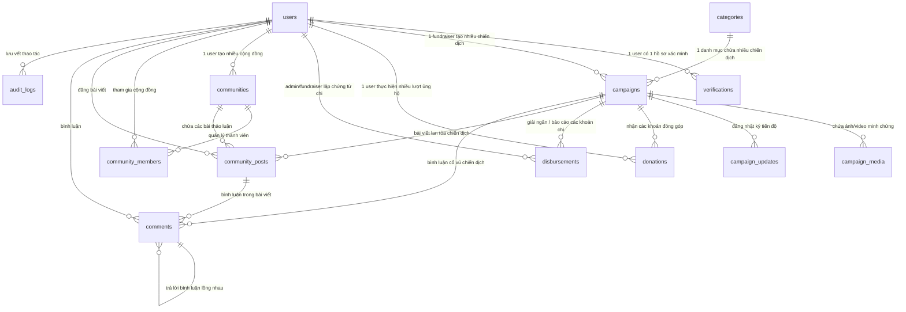

# Tài Liệu Thiết Kế Cơ Sở Dữ Liệu - Crowdfunding Platform (CĐ09)

Hệ thống sử dụng cơ sở dữ liệu quan hệ **MySQL 8.0** kết hợp cùng **Prisma ORM** (TypeScript) ở tầng Backend.

---

## 1. Sơ đồ Quan hệ Thực thể (ERD)

---

## 2. Từ điển Dữ liệu (Data Dictionary)

### 2.1. Bảng `users` (Người dùng & Tài khoản)
| Tên cột | Kiểu dữ liệu | Ràng buộc | Diễn giải |
| :--- | :--- | :--- | :--- |
| `id` | VARCHAR(36) | PK | Mã định danh UUID v4 |
| `email` | VARCHAR(255) | UNIQUE, NOT NULL | Địa chỉ email đăng nhập |
| `password_hash` | VARCHAR(255) | NOT NULL | Mật khẩu băm (bcrypt) |
| `full_name` | VARCHAR(150) | NOT NULL | Họ và tên hiển thị |
| `phone_number` | VARCHAR(20) | NULL | Số điện thoại |
| `avatar_url` | VARCHAR(500) | NULL | Đường dẫn ảnh đại diện (MinIO S3) |
| `bio` | TEXT | NULL | Tiểu sử ngắn |
| `role` | ENUM | NOT NULL | `ADMIN`, `FUNDRAISER`, `USER` |
| `status` | ENUM | NOT NULL | `ACTIVE`, `SUSPENDED`, `BANNED` |
| `is_email_verified` | BOOLEAN | DEFAULT FALSE | Trạng thái xác thực email |
| `email_verified_at` | DATETIME(3) | NULL | Thời điểm xác thực email |
| `created_at` | DATETIME(3) | DEFAULT CURRENT_TIMESTAMP | Thời gian tạo |
| `updated_at` | DATETIME(3) | ON UPDATE CURRENT_TIMESTAMP | Thời gian cập nhật |

### 2.2. Bảng `verifications` (Hồ sơ xác minh KYC Người gây quỹ)
| Tên cột | Kiểu dữ liệu | Ràng buộc | Diễn giải |
| :--- | :--- | :--- | :--- |
| `id` | VARCHAR(36) | PK | Mã định danh UUID v4 |
| `user_id` | VARCHAR(36) | UNIQUE, FK -> users | Người dùng gửi hồ sơ KYC |
| `id_card_number` | VARCHAR(50) | NOT NULL | Số CCCD/Hộ chiếu |
| `card_issued_date` | DATE | NULL | Ngày cấp CCCD |
| `card_issued_place`| VARCHAR(200) | NULL | Nơi cấp CCCD |
| `front_card_image` | VARCHAR(500) | NOT NULL | Ảnh mặt trước CCCD |
| `back_card_image`  | VARCHAR(500) | NOT NULL | Ảnh mặt sau CCCD |
| `portrait_image`   | VARCHAR(500) | NOT NULL | Ảnh chân dung cầm CCCD |
| `supporting_documents` | JSON | NULL | Danh sách giấy tờ bệnh án, giấy chứng nhận |
| `status` | ENUM | NOT NULL | `PENDING`, `APPROVED`, `REJECTED` |
| `rejection_reason` | TEXT | NULL | Lý do từ chối (nếu có) |
| `reviewed_by` | VARCHAR(36) | FK -> users | Admin duyệt hồ sơ |
| `reviewed_at` | DATETIME(3) | NULL | Thời điểm duyệt |

### 2.3. Bảng `categories` (Danh mục)
| Tên cột | Kiểu dữ liệu | Ràng buộc | Diễn giải |
| :--- | :--- | :--- | :--- |
| `id` | VARCHAR(36) | PK | UUID v4 |
| `name` | VARCHAR(100) | NOT NULL | Tên danh mục (Y tế, Giáo dục,...) |
| `slug` | VARCHAR(120) | UNIQUE, NOT NULL | Đường dẫn thân thiện URL |
| `description` | TEXT | NULL | Mô tả danh mục |
| `icon_url` | VARCHAR(500) | NULL | Tên icon hoặc link ảnh |
| `is_active` | BOOLEAN | DEFAULT TRUE | Trạng thái hiển thị |

### 2.4. Bảng `campaigns` (Chiến dịch gây quỹ)
| Tên cột | Kiểu dữ liệu | Ràng buộc | Diễn giải |
| :--- | :--- | :--- | :--- |
| `id` | VARCHAR(36) | PK | UUID v4 |
| `fundraiser_id` | VARCHAR(36) | FK -> users | Người chủ trì gây quỹ |
| `category_id` | VARCHAR(36) | FK -> categories | Danh mục chiến dịch |
| `title` | VARCHAR(255) | NOT NULL | Tiêu đề chiến dịch |
| `slug` | VARCHAR(280) | UNIQUE, NOT NULL | Slug URL |
| `short_description`| VARCHAR(500) | NOT NULL | Mô tả tóm tắt |
| `story` | LONGTEXT | NOT NULL | Nội dung chi tiết hoàn cảnh |
| `cover_image_url` | VARCHAR(500) | NOT NULL | Ảnh bìa đại diện |
| `target_amount` | DECIMAL(15, 2) | NOT NULL | Số tiền cần gây quỹ |
| `current_amount` | DECIMAL(15, 2) | DEFAULT 0.00 | Số tiền đã quyên góp được |
| `donor_count` | INT UNSIGNED | DEFAULT 0 | Tổng số lượt quyên góp |
| `start_date` | DATETIME(3) | NOT NULL | Ngày bắt đầu nhận tiền |
| `end_date` | DATETIME(3) | NOT NULL | Ngày kết thúc chiến dịch |
| `status` | ENUM | NOT NULL | `DRAFT`, `PENDING_APPROVAL`, `ACTIVE`, `PAUSED`, `COMPLETED`, `REJECTED`, `CANCELLED` |
| `bank_account_number` | VARCHAR(50) | NOT NULL | Số tài khoản ngân hàng nhận tiền |
| `bank_name` | VARCHAR(100) | NOT NULL | Tên ngân hàng |
| `bank_account_name` | VARCHAR(150) | NOT NULL | Tên chủ sở hữu tài khoản |

### 2.5. Bảng `donations` (Giao dịch đóng góp)
| Tên cột | Kiểu dữ liệu | Ràng buộc | Diễn giải |
| :--- | :--- | :--- | :--- |
| `id` | VARCHAR(36) | PK | UUID v4 |
| `campaign_id` | VARCHAR(36) | FK -> campaigns | Chiến dịch được ủng hộ |
| `donor_id` | VARCHAR(36) | NULL, FK -> users | Người đóng góp (nếu đã đăng nhập) |
| `transaction_code`| VARCHAR(64) | UNIQUE, NOT NULL | Mã giao dịch đối soát |
| `amount` | DECIMAL(15, 2) | NOT NULL | Số tiền quyên góp (VNĐ) |
| `donor_name` | VARCHAR(150) | NOT NULL | Tên hiển thị của người ủng hộ |
| `donor_email` | VARCHAR(255) | NULL | Email nhận biên lai điện tử |
| `donor_phone` | VARCHAR(20) | NULL | Số điện thoại |
| `message` | VARCHAR(500) | NULL | Lời nhắn gửi tới người nhận |
| `is_anonymous` | BOOLEAN | DEFAULT FALSE | Ẩn danh (che tên trên BXH) |
| `payment_method` | ENUM | NOT NULL | `BANK_TRANSFER`, `VNPAY`, `MOMO`, `STRIPE` |
| `payment_status` | ENUM | NOT NULL | `PENDING`, `SUCCESS`, `FAILED`, `REFUNDED` |
| `paid_at` | DATETIME(3) | NULL | Thời gian thanh toán thành công |

### 2.6. Bảng `disbursements` (Minh bạch chi tiêu / Giải ngân - Transparency)
| Tên cột | Kiểu dữ liệu | Ràng buộc | Diễn giải |
| :--- | :--- | :--- | :--- |
| `id` | VARCHAR(36) | PK | UUID v4 |
| `campaign_id` | VARCHAR(36) | FK -> campaigns | Thuộc chiến dịch nào |
| `title` | VARCHAR(255) | NOT NULL | Nội dung đợt chi (VD: Mua 500 suất quà) |
| `amount` | DECIMAL(15, 2) | NOT NULL | Số tiền giải ngân |
| `disbursement_date`| DATE | NOT NULL | Ngày thực tế chi tiêu |
| `proof_documents` | JSON | NOT NULL | Mảng URL ảnh hoá đơn đỏ, biên nhận viện phí |
| `note` | TEXT | NULL | Ghi chú thêm |
| `created_by` | VARCHAR(36) | FK -> users | Người đăng báo cáo |

### 2.7. Bảng `audit_logs` (Nhật ký kiểm toán - Append Only)
| Tên cột | Kiểu dữ liệu | Ràng buộc | Diễn giải |
| :--- | :--- | :--- | :--- |
| `id` | VARCHAR(36) | PK | UUID v4 |
| `user_id` | VARCHAR(36) | NULL, FK -> users | Người thực hiện thao tác |
| `action` | VARCHAR(100) | NOT NULL | Mã hành vi (`APPROVE_CAMPAIGN`, `REFUND`,...) |
| `entity_name` | VARCHAR(50) | NOT NULL | Tên bảng bị tác động |
| `entity_id` | VARCHAR(36) | NOT NULL | ID bản ghi bị tác động |
| `details` | JSON | NULL | Chi tiết thay đổi trước và sau |
| `ip_address` | VARCHAR(45) | NULL | Địa chỉ IP |
| `created_at` | DATETIME(3) | DEFAULT CURRENT_TIMESTAMP | Thời điểm ghi log (Không cho phép UPDATE/DELETE) |

---

## 3. Các thực thể Hỗ trợ Cộng đồng & Tương tác
- **`campaign_media`**: Quản lý bộ sưu tập ảnh và video của từng chiến dịch.
- **`campaign_updates`**: Cho phép Fundraiser đăng nhật ký cập nhật tình hình hồi phục, trao quà.
- **`communities` & `community_members`**: Nhóm thiện nguyện kết nối các tình nguyện viên.
- **`community_posts` & `comments`**: Diễn đàn trao đổi, bình luận lồng nhau nhiều cấp.
