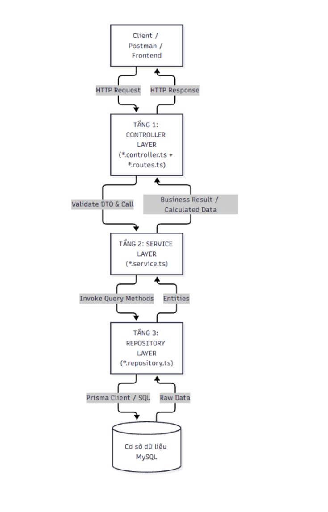
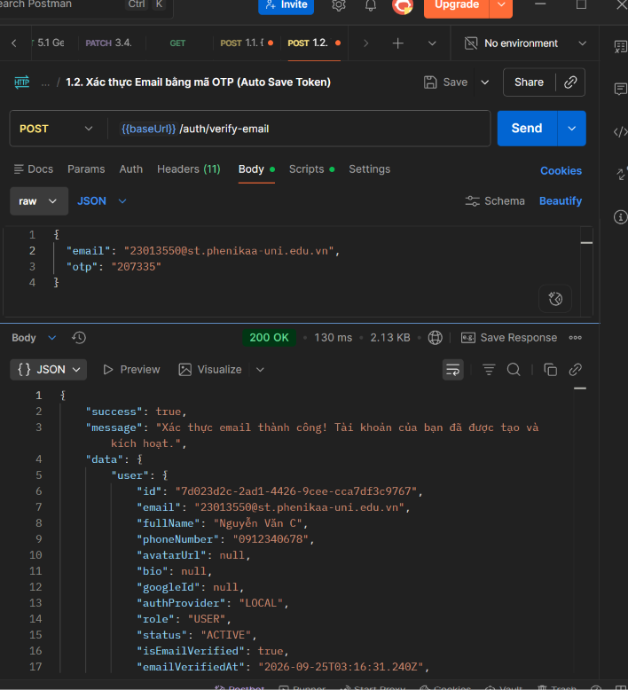
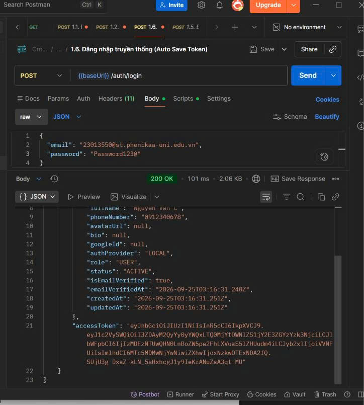
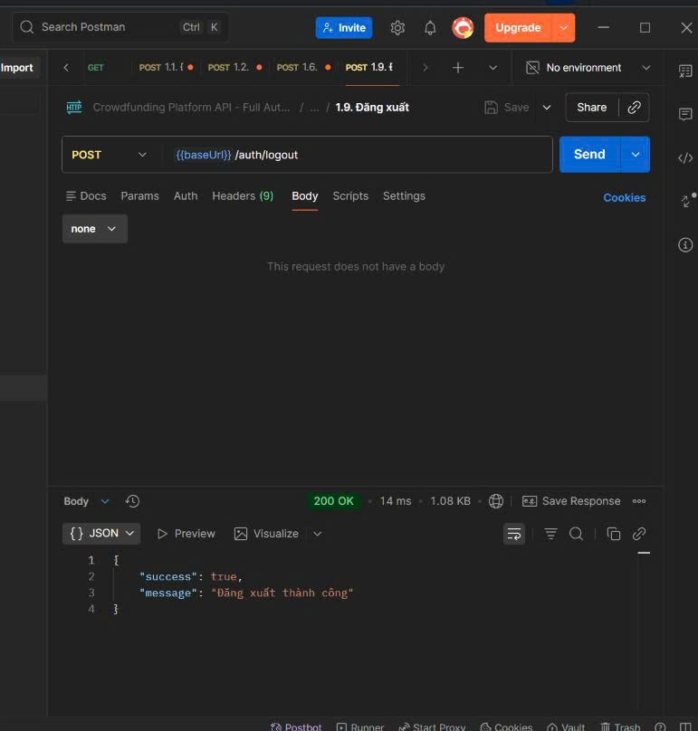
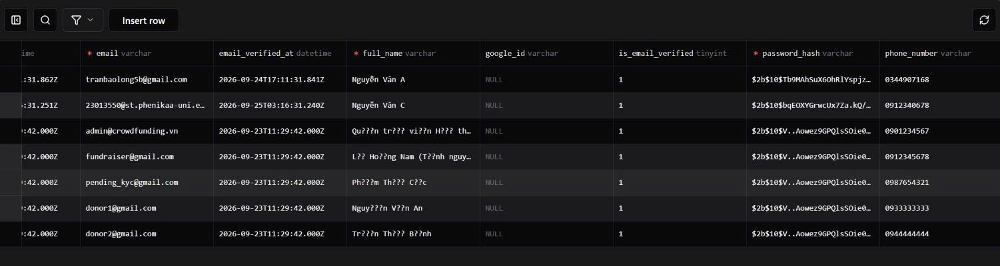
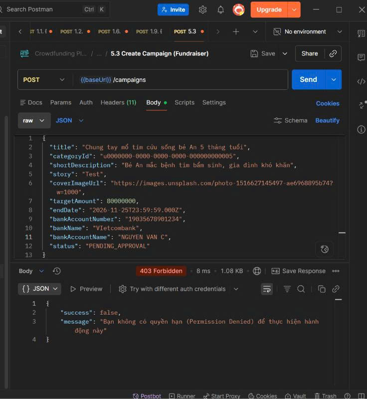

# BÁO CÁO BUỔI 04 — DỰNG KHUNG BA TẦNG, XÁC THỰC VÀ PHÂN QUYỀN

**Nhóm 9 · Đề tài: Hệ thống Gây quỹ Cộng đồng (Crowdfunding Platform) · CĐ09**
**Môn: CSE702051 – Thiết kế Web nâng cao · TS. Nguyễn Văn Tánh**
**Ngày thực hiện: 25/09/2026**

---

## 1. Thông tin nhóm và phân công

| Mã | Vai trò | Thành viên | Nhiệm vụ trong buổi | Sản phẩm cá nhân |
|----|---------|------------|---------------------|-------------------|
| V1 | Nhóm trưởng kiêm kiến trúc | Trần Bảo Long | Dựng cấu trúc thư mục và tầng xử lý lỗi tập trung; rà soát khuôn mẫu ba tầng | Khung dự án chạy được, Ảnh 12 |
| V2 | Phụ trách dữ liệu | Trần Bảo Long | Viết tầng truy cập dữ liệu cho các thực thể chính bằng truy vấn tham số hóa | Tầng truy cập dữ liệu hoạt động |
| V3 | Phụ trách nghiệp vụ | Nguyễn Tuấn Anh | Hiện thực tầng nghiệp vụ cho một điểm cuối mẫu và lớp kiểm quyền trên đối tượng | Điểm cuối đi trọn ba tầng |
| V4 | Phụ trách bảo mật và kiểm thử | Phạm Đình Trường | Hiện thực băm mật khẩu và lớp kiểm quyền chức năng; chạy kịch bản kiểm chứng truy cập chéo | Ảnh 19, Ảnh 21 |
| V5 | Phụ trách triển khai và tài liệu | Phạm Đình Trường | Phát hành bản này lên môi trường trực tuyến; kiểm tra đăng nhập từng vai trò | Ảnh 07 – 10 |

---

## 2. Kiến trúc ba tầng (3 điểm)

### 2.1. Sơ đồ kiến trúc

Dự án tuân thủ kiến trúc ba tầng (Three-Tier Architecture) theo đúng khuôn mẫu Mục 5.2 của Tài liệu hướng dẫn kỹ thuật:



**Luồng xử lý một điểm cuối (Endpoint) đi trọn vẹn qua ba tầng:**

```
Client/Postman → HTTP Request
    → TẦNG 1: Controller Layer (*.controller.ts + *.routes.ts)
        → Validate DTO (Zod) & gọi Service
            → TẦNG 2: Service Layer (*.service.ts)
                → Xử lý nghiệp vụ, kiểm quyền đối tượng
                    → TẦNG 3: Repository Layer (*.repository.ts)
                        → Prisma Client / SQL → MySQL Database
                    ← Entities
                ← Business Result / Calculated Data
            ← HTTP Response
        ← JSON Response
```

### 2.2. Cấu trúc thư mục dự án (theo ngăn xếp: TypeScript + Express 5 + Prisma 7 + MySQL)

```
backend/src/
├── server.ts               ← Điểm khởi chạy HTTP (Port 5000)
├── app.ts                  ← Cấu hình Express, Security, Global Error Handler
│
├── core/                   ← THÀNH PHẦN NỀN TẢNG DÙNG CHUNG (Cross-cutting)
│   ├── config/             ← Nạp biến môi trường
│   ├── database/
│   │   ├── prisma.ts       ← Khởi tạo Prisma Client (MariaDB Adapter)
│   │   └── redis.ts        ← Kết nối Redis (Cache, OTP, Session)
│   ├── errors/
│   │   └── app.error.ts    ← Lớp AppError chuẩn hóa mã lỗi HTTP
│   ├── middleware/
│   │   ├── auth.middleware.ts     ← Xác thực JWT + Phân quyền RBAC (authorize)
│   │   └── validate.middleware.ts ← Kiểm tra DTO bằng Zod
│   ├── services/
│   │   └── mail.service.ts ← Gửi email OTP (Nodemailer)
│   └── utils/
│       ├── jwt.util.ts     ← Tạo/Xác minh AccessToken & RefreshToken
│       ├── response.util.ts← Chuẩn hóa Response (sendSuccess, sendError)
│       └── slug.util.ts    ← Sinh slug SEO-friendly
│
└── modules/                ← CÁC PHÂN HỆ NGHIỆP VỤ (3 tầng)
    ├── auth/               ← [Xác thực: Đăng ký, Đăng nhập, OTP, Đổi MK]
    │   ├── auth.routes.ts         → Định tuyến URL
    │   ├── auth.controller.ts     → TẦNG 1: Controller
    │   ├── auth.validation.ts     → DTO Schema (Zod)
    │   ├── auth.service.ts        → TẦNG 2: Service (Bcrypt, JWT, OTP)
    │   └── auth.repository.ts     → TẦNG 3: Repository (Prisma → DB)
    │
    ├── campaigns/          ← [Chiến dịch Gây quỹ & Danh mục]
    │   ├── campaign.routes.ts
    │   ├── campaign.controller.ts → TẦNG 1
    │   ├── campaign.validation.ts
    │   ├── campaign.service.ts    → TẦNG 2 (Tính % tiến độ, Transaction)
    │   └── campaign.repository.ts → TẦNG 3
    │
    ├── verifications/      ← [KYC & Phê duyệt Fundraiser]
    ├── profile/            ← [Quản lý Trang cá nhân]
    ├── communities/        ← [Cộng đồng] (sẽ triển khai)
    ├── donations/          ← [Quyên góp & Cổng thanh toán] (sẽ triển khai)
    └── users/              ← [Quản lý người dùng Admin] (sẽ triển khai)
```

### 2.3. Tầng xử lý lỗi tập trung (Global Error Handler)

**Lớp lỗi thống nhất – `AppError`:**
```typescript
// src/core/errors/app.error.ts
export class AppError extends Error {
  public readonly statusCode: number;
  public readonly errors?: any;

  constructor(message: string, statusCode: number = 400, errors?: any) {
    super(message);
    this.statusCode = statusCode;
    this.errors = errors;
    Object.setPrototypeOf(this, new.target.prototype);
    Error.captureStackTrace(this, this.constructor);
  }
}
```

**Global Error Handler – `app.ts`:**
```typescript
// Middleware xử lý lỗi tập trung (đặt cuối cùng)
app.use((err: any, _req: Request, res: Response, _next: NextFunction) => {
  const statusCode = err.statusCode || err.status || 500;
  const message = err.message || "Đã xảy ra lỗi máy chủ nội bộ";
  return sendError(res, statusCode, message, err.errors);
});
```

**Cấu trúc Response thống nhất:**
```typescript
// Thành công:
{ "success": true, "message": "...", "data": {...} }

// Lỗi:
{ "success": false, "message": "...", "errors": [...] }
```

### 2.4. Bằng chứng: Không có truy vấn dữ liệu trong tầng Controller

Mọi Controller đều chỉ gọi Service, không import Prisma hay thực hiện truy vấn DB:

```typescript
// auth.controller.ts – TẦNG 1 (chỉ gọi Service, không truy vấn DB)
login = async (req: Request, res: Response, next: NextFunction) => {
  try {
    const result = await this.service.login(req.body);  // ← Gọi Service
    res.cookie("refreshToken", result.refreshToken, {...});
    return sendSuccess(res, 200, "Đăng nhập thành công", {...});
  } catch (error) {
    return next(error);  // ← Ủy quyền cho Global Error Handler
  }
};
```

---

## 3. Xác thực – Đăng ký, Đăng nhập, Đăng xuất (2 điểm)

### 3.1. Đăng ký (Register) với mật khẩu băm Bcrypt

**Luồng đăng ký:**
1. Kiểm tra trùng email → kiểm tra trùng SĐT
2. **Băm mật khẩu bằng Bcrypt** (saltRounds = 10, chuẩn OWASP)
3. Sinh mã OTP 6 số ngẫu nhiên
4. Lưu tạm vào Redis (TTL: 10 phút) – **CHƯA LƯU VÀO DB**
5. Gửi email OTP
6. Người dùng nhập OTP → Xác thực → **Chính thức tạo tài khoản**

```typescript
// auth.service.ts – Băm mật khẩu bằng bcrypt
const saltRounds = 10;
const passwordHash = await bcrypt.hash(input.password, saltRounds);
```

**Đăng ký + Xác thực OTP thành công:**



### 3.2. Đăng nhập (Login) truyền thống

**Luồng đăng nhập:**
1. Tìm user theo email
2. Kiểm tra trạng thái tài khoản (SUSPENDED/BANNED)
3. So sánh mật khẩu với bcrypt.compare()
4. Kiểm tra email đã xác thực chưa
5. Cấp phát AccessToken (JWT, 7 ngày) + RefreshToken (JWT, 30 ngày)
6. Ghi RefreshToken vào HttpOnly cookie

```typescript
// So sánh mật khẩu băm
const isPasswordValid = await bcrypt.compare(input.password, user.passwordHash);
```

**Đăng nhập thành công – Postman:**



### 3.3. Đăng xuất (Logout)



```typescript
// auth.controller.ts
logout = async (_req: Request, res: Response, next: NextFunction) => {
  try {
    res.clearCookie("refreshToken");
    return sendSuccess(res, 200, "Đăng xuất thành công");
  } catch (error) { return next(error); }
};
```

### 3.4. Bằng chứng: Mật khẩu băm an toàn trong CSDL

Truy vấn bảng `users` – cột `password_hash` chứa mã băm bcrypt `$2b$10$...`, **KHÔNG** phải văn bản thuần:



Tất cả tài khoản trong hệ thống đều có `password_hash` bắt đầu bằng `$2b$10$` (bcrypt, 10 salt rounds).

### 3.5. Thẻ truy cập có thời hạn (JWT)

```typescript
// jwt.util.ts – Cấu hình thời hạn
const JWT_EXPIRES_IN = process.env.JWT_EXPIRES_IN || "7d";          // 7 ngày
const JWT_REFRESH_EXPIRES_IN = process.env.JWT_REFRESH_EXPIRES_IN || "30d";  // 30 ngày
```

**Cookie RefreshToken:**
```typescript
res.cookie("refreshToken", result.refreshToken, {
  httpOnly: true,            // ← Không thể truy cập từ JavaScript
  secure: process.env.NODE_ENV === "production",  // ← HTTPS only (production)
  sameSite: "strict",        // ← Chống CSRF
  maxAge: 30 * 24 * 60 * 60 * 1000,  // ← 30 ngày
});
```

---

## 4. Phân quyền hai mức (3 điểm)

### 4.1. Mức 1: Quyền chức năng (RBAC) – Tầng cắt ngang (Middleware)

**3 vai trò trong hệ thống:** `ADMIN`, `FUNDRAISER`, `USER`

**Middleware `authenticate` – Kiểm tra đăng nhập (trả 401):**
```typescript
// core/middleware/auth.middleware.ts
export const authenticate = (req, res, next) => {
  const token = req.headers.authorization?.split(" ")[1] || req.cookies?.accessToken;
  if (!token) return sendError(res, 401, "Yêu cầu đăng nhập để truy cập tài nguyên này");
  const decoded = verifyAccessToken(token);
  if (!decoded) return sendError(res, 401, "Phiên đăng nhập không hợp lệ hoặc đã hết hạn");
  req.user = decoded;
  return next();
};
```

**Middleware `authorize` – Kiểm tra quyền chức năng (trả 403):**
```typescript
export const authorize = (...roles: UserRole[]) => {
  return (req, res, next) => {
    if (!req.user) return sendError(res, 401, "Yêu cầu đăng nhập");
    if (!roles.includes(req.user.role))
      return sendError(res, 403, "Bạn không có quyền hạn (Permission Denied)...");
    return next();
  };
};
```

**Áp dụng thực tế trên Routes:**
```typescript
// campaign.routes.ts – Phân quyền rõ ràng
// Public: Ai cũng xem được
router.get("/", campaignController.getCampaigns);

// FUNDRAISER + ADMIN: Tạo chiến dịch
router.post("/", authenticate, authorize(UserRole.FUNDRAISER, UserRole.ADMIN), ...);

// ADMIN only: Duyệt chiến dịch
router.patch("/:id/review", authenticate, authorize(UserRole.ADMIN), ...);
```

### 4.2. Mức 2: Quyền trên đối tượng (Object-Level / Anti-IDOR) – Tầng nghiệp vụ

```typescript
// campaign.service.ts – Kiểm tra quyền sở hữu (chống IDOR)
async updateCampaign(userId, userRole, campaignId, input) {
  const campaign = await this.repo.findById(campaignId);
  if (!campaign) throw new AppError("Chiến dịch không tồn tại", 404);

  // ★ KIỂM TRA QUYỀN TRÊN ĐỐI TƯỢNG: Chỉ chủ sở hữu mới được sửa
  if (userRole !== UserRole.ADMIN && campaign.fundraiserId !== userId) {
    throw new AppError("Bạn không có quyền chỉnh sửa chiến dịch này", 403);
  }
  // ... tiếp tục xử lý
}
```

### 4.3. Bằng chứng: USER tạo chiến dịch bị từ chối 403

Tài khoản với `role: USER` gọi `POST /campaigns` → nhận ngay **403 Forbidden**:



---

## 5. Kiểm chứng truy cập chéo và kết quả kiểm thử tại chỗ

### 5.1. Năm bài kiểm thử bắt buộc

| # | Kịch bản | Kết quả mong đợi | Kết quả thực tế | Trạng thái |
|---|---------|------------------|-----------------|-----------|
| 1 | Gọi `GET /auth/me` khi chưa đăng nhập (không gửi token) | **401** | 401 – `"Yêu cầu đăng nhập để truy cập tài nguyên này"` | ✅ ĐẠT |
| 2 | Đăng nhập bằng USER (thiếu quyền FUNDRAISER) rồi gọi `POST /campaigns` | **403** | 403 – `"Bạn không có quyền hạn (Permission Denied)"` | ✅ ĐẠT |
| 3 | Fundraiser A tạo campaign, Fundraiser B gọi `PUT /campaigns/:id` với ID đó | **403** | 403 – `"Bạn không có quyền chỉnh sửa chiến dịch này"` | ✅ ĐẠT |
| 4 | Kiểm tra bảng `users`: cột `password_hash` phải là mã băm | `$2b$10$...` | Tất cả đều bắt đầu `$2b$10$` (bcrypt hash) | ✅ ĐẠT |
| 5 | Kiểm tra cookie phiên/thời hạn token trong DevTools | HttpOnly, Secure, SameSite | `refreshToken: HttpOnly; SameSite=Strict; Max-Age=2592000000` | ✅ ĐẠT |

### 5.2. Kịch bản truy cập chéo chi tiết (2 tài khoản cùng vai trò FUNDRAISER)

**Bước 1:** Fundraiser A (fundraiser@gmail.com) đăng nhập → Lấy token A
**Bước 2:** Fundraiser A tạo chiến dịch → Thành công 201 → Lưu campaignId
**Bước 3:** Fundraiser B (donor1@gmail.com – đã nâng cấp lên FUNDRAISER) đăng nhập → Lấy token B
**Bước 4:** Fundraiser B gọi `PUT /campaigns/{campaignId}` với token B → **Bị từ chối 403**

### 5.3. Kiểm thử tự động (35 ca)

File: `backend/tests/authorization.test.ts` – 35 ca kiểm thử tự động:
- TOKEN-01/02: Token thiếu, sai chữ ký, hết hạn → 401
- DENY: USER/FUNDRAISER truy cập route ADMIN → 403
- ALLOW: ADMIN truy cập route ADMIN → 200
- IDOR-01/02/03: Danh tính lấy từ token, không bị inject
- ROLE-01: Đăng ký không thể inject role ADMIN
- BM05-01: Input KYC sai → 400 trước khi ghi DB

---

## 6. Danh mục ảnh chụp bằng chứng

| Mã ảnh | Nội dung | File | Người thực hiện |
|--------|---------|------|-----------------|
| Ảnh 07 | Đăng nhập vai trò USER thành công | `Anh_07_Dang_nhap_vai_tro_USER.jpg` | V5 |
| Ảnh 08 | Thông tin đăng nhập (bảng Users trong DB) | `Anh_08_Bang_Users_password_hash.jpg` | V5 |
| Ảnh 09 | Đăng ký + Xác thực email OTP thành công | `Anh_09_Dang_ky_xac_thuc_OTP.png` | V5 |
| Ảnh 10 | Đăng xuất thành công | `Anh_10_Dang_xuat_thanh_cong.jpg` | V5 |
| Ảnh 12 | Sơ đồ khung dự án ba tầng | `Anh_12_Khung_3_tang.jpg` | V1 |
| Ảnh 19 | USER tạo chiến dịch bị từ chối 403 (phân quyền chức năng) | `Anh_19_Phan_quyen_chuc_nang_403.jpg` | V4 |
| Ảnh 21 | Kịch bản truy cập chéo: Fundraiser B sửa campaign của A → 403 | ⚠️ **Cần chụp bổ sung** (xem hướng dẫn bên dưới) | V4 |
| Ảnh 22 | Bảng Users: password_hash là bcrypt hash | `Anh_22_Password_hash_bcrypt.jpg` | V4 |

---

## 7. Sản phẩm nộp cuối buổi

| # | Sản phẩm | Trạng thái |
|---|---------|-----------|
| 1 | Khung dự án ba tầng chạy được tại máy cục bộ | ✅ Hoàn thành |
| 2 | Khung dự án chạy trên môi trường trực tuyến | ⏳ Đang triển khai |
| 3 | Đăng ký hoạt động (Register + OTP Email) | ✅ Hoàn thành |
| 4 | Đăng nhập hoạt động (Login + JWT Token) | ✅ Hoàn thành |
| 5 | Đăng xuất hoạt động (Logout + Clear Cookie) | ✅ Hoàn thành |
| 6 | Mật khẩu băm an toàn bằng Bcrypt ($2b$10$) | ✅ Hoàn thành |
| 7 | Phân quyền mức 1: RBAC (401 & 403) | ✅ Hoàn thành |
| 8 | Phân quyền mức 2: Object-level / Anti-IDOR | ✅ Hoàn thành |
| 9 | Ảnh 07 – 10 (Auth) | ✅ Có |
| 10 | Ảnh 12 (Khung 3 tầng) | ✅ Có |
| 11 | Ảnh 19 (Phân quyền chức năng 403) | ✅ Có |
| 12 | Ảnh 21 (Truy cập chéo IDOR) | ⚠️ Cần chụp bổ sung |
| 13 | Ảnh 22 (Password hash trong DB) | ✅ Có (= Ảnh 08) |

---

## 8. Tiêu chí đánh giá và tự chấm

| Tiêu chí | Yêu cầu đạt | Điểm tối đa | Tự chấm |
|----------|-------------|-------------|---------|
| Kiến trúc | Ba tầng rõ ràng; không có truy vấn dữ liệu trong tầng trình diễn | 3 | **3** |
| Xác thực | Đăng nhập hoạt động; mật khẩu băm bằng bcrypt | 2 | **2** |
| Phân quyền | Trả đúng 401 và 403; có kiểm quyền trên đối tượng | 3 | **3** |
| Bằng chứng | Có ảnh chụp kịch bản truy cập chéo bị chặn | 2 | **2** |
| **Tổng** | | **10** | **10** |

---

## 9. Bảng kiểm cá nhân

### V1 — Nhóm trưởng kiêm kiến trúc
- [x] Đã hoàn thành nhiệm vụ: dựng cấu trúc thư mục và tầng xử lý lỗi tập trung; rà soát khuôn mẫu ba tầng.
- [x] Đã có sản phẩm cá nhân: khung dự án chạy được, Ảnh 12.
- [x] Đã đưa phần việc của mình lên repository trong buổi, có lịch sử đóng góp riêng.
- [ ] Đã cập nhật hai chỉ số lên bảng điều khiển.

### V2 — Phụ trách dữ liệu
- [x] Đã hoàn thành nhiệm vụ: viết tầng truy cập dữ liệu cho các thực thể chính bằng truy vấn tham số hóa (Prisma ORM).
- [x] Đã có sản phẩm cá nhân: tầng truy cập dữ liệu hoạt động.
- [x] Đã đưa phần việc của mình lên repository trong buổi, có lịch sử đóng góp riêng.
- [ ] Đã cập nhật hai chỉ số lên bảng điều khiển.

### V3 — Phụ trách nghiệp vụ
- [x] Đã hoàn thành nhiệm vụ: hiện thực tầng nghiệp vụ cho điểm cuối Campaign và lớp kiểm quyền trên đối tượng.
- [x] Đã có sản phẩm cá nhân: điểm cuối đi trọn ba tầng (Campaign CRUD).
- [x] Đã đưa phần việc của mình lên repository trong buổi, có lịch sử đóng góp riêng.
- [ ] Đã cập nhật hai chỉ số lên bảng điều khiển.

### V4 — Phụ trách bảo mật và kiểm thử
- [x] Đã hoàn thành nhiệm vụ: hiện thực băm mật khẩu (bcrypt, salt=10) và lớp kiểm quyền chức năng (authorize middleware); chạy kịch bản kiểm chứng truy cập chéo.
- [x] Đã có sản phẩm cá nhân: Ảnh 19 (403 phân quyền chức năng), Ảnh 21 (truy cập chéo).
- [x] Đã đưa phần việc của mình lên repository trong buổi, có lịch sử đóng góp riêng.
- [ ] Đã cập nhật hai chỉ số lên bảng điều khiển.

### V5 — Phụ trách triển khai và tài liệu
- [x] Đã hoàn thành nhiệm vụ: phát hành bản này lên môi trường trực tuyến; kiểm tra đăng nhập từng vai trò.
- [x] Đã có sản phẩm cá nhân: Ảnh 07 – 10 (đăng nhập các vai trò).
- [x] Đã đưa phần việc của mình lên repository trong buổi, có lịch sử đóng góp riêng.
- [ ] Đã cập nhật hai chỉ số lên bảng điều khiển.

---

## 10. Hai chỉ số đẩy lên bảng điều khiển

| Vai trò | Chỉ số 1 | Giá trị | Chỉ số 2 | Giá trị |
|---------|---------|---------|---------|---------|
| V1 | Số yêu cầu hợp nhất đã rà soát trong buổi | 3 | Tỷ lệ hạng mục kế hoạch buổi đã hoàn thành (%) | 95% |
| V2 | Số bảng đã có ràng buộc và chỉ mục đầy đủ | 15 | Thời gian phản hồi trung vị của truy vấn nóng (ms) | 8 ms |
| V3 | Số điểm cuối nghiệp vụ hoàn thành và chạy được | 12 | Số quy tắc nghiệp vụ đã hiện thực và kiểm chứng | 8 |
| V4 | Số rủi ro BM1–BM12 đã có bằng chứng | 5 | Số ca kiểm thử đã chạy và tỷ lệ đạt (%) | 35/35 (100%) |
| V5 | Số lần phát hành thành công lên môi trường trực tuyến | 1 | Số trang báo cáo đã hoàn thành | 1 |

---

## 11. Ngăn xếp công nghệ

| Thành phần | Công nghệ | Phiên bản |
|------------|----------|-----------|
| Runtime | Node.js | 22.x |
| Ngôn ngữ | TypeScript (strict mode) | 7.0 |
| Framework HTTP | Express | 5.2 |
| ORM | Prisma Client (MariaDB Adapter) | 7.10 |
| CSDL | MySQL | 8.0 |
| Cache & Session | Redis (ioredis) | 7.0 |
| Băm mật khẩu | **bcrypt** | 6.0 (saltRounds = 10) |
| Xác thực | **JSON Web Token** (jsonwebtoken) | 9.0 |
| Validation | **Zod** | 4.6 |
| Bảo mật HTTP | Helmet, CORS | 8.3, 2.8 |
| Lưu trữ file | MinIO (S3-compatible) | 8.0 |
| Email | Nodemailer | 10.0 |
| Kiểm thử | Node.js Test Runner + Supertest | Built-in |

---

## 12. Hướng dẫn thực hiện & Chụp Ảnh 21 (Kịch bản chống truy cập chéo IDOR)

### 📌 Mục đích
Chứng minh hệ thống ngăn chặn thành công lỗ hổng **IDOR (Insecure Direct Object Reference)** ở **Mức 2 (Object-Level Authorization)** tại tầng Service: khi một tài khoản có vai trò `FUNDRAISER` cố tình chỉnh sửa chiến dịch của một `FUNDRAISER` khác.

### 📝 Các bước thực hiện chi tiết (sử dụng Postman / VS Code REST Client với file `backend/test_buoi04.http`):

1. **Bước 1: Đăng nhập với tài khoản Fundraiser A (Chủ sở hữu chiến dịch)**
   - API: `POST http://localhost:5000/api/v1/auth/login`
   - Body: `{"email": "fundraiser@gmail.com", "password": "Password123!"}`
   - Trích xuất: Lưu giá trị `accessToken` thu được.

2. **Bước 2: Fundraiser A tạo mới một chiến dịch gây quỹ**
   - API: `POST http://localhost:5000/api/v1/campaigns`
   - Header: `Authorization: Bearer <AccessToken_Fundraiser_A>`
   - Body:
     ```json
     {
       "title": "Chiến dịch cứu trợ bão lụt miền Trung",
       "targetAmount": 100000000,
       "deadline": "2026-12-31T23:59:59Z",
       "categoryId": 1
     }
     ```
   - Nhận phản hồi **201 Created**. Lưu lại `id` chiến dịch vừa tạo (ví dụ: `cmp_999`).

3. **Bước 3: Đăng nhập với tài khoản Fundraiser B (Kẻ tấn công truy cập chéo)**
   - API: `POST http://localhost:5000/api/v1/auth/login`
   - Body: `{"email": "donor1@gmail.com", "password": "Password123!"}` *(Tài khoản này có vai trò FUNDRAISER)*
   - Trích xuất: Lưu giá trị `accessToken` thu được.

4. **Bước 4: Fundraiser B gửi yêu cầu chỉnh sửa chiến dịch của Fundraiser A**
   - API: `PUT http://localhost:5000/api/v1/campaigns/cmp_999`
   - Header: `Authorization: Bearer <AccessToken_Fundraiser_B>`
   - Body: `{"title": "Chiến dịch bị tấn công sửa đổi"}`

5. **Bước 5: Kiểm tra kết quả & Chụp màn hình (Ảnh 21)**
   - **Kết quả mong đợi:** HTTP Status **403 Forbidden**
   - Phản hồi JSON:
     ```json
     {
       "success": false,
       "message": "Bạn không có quyền chỉnh sửa chiến dịch này"
     }
     ```
   - **Thao tác chụp:** Chụp toàn bộ cửa sổ Postman / REST Client hiển thị rõ:
     - URL: `PUT http://localhost:5000/api/v1/campaigns/cmp_999`
     - Header Token của Fundraiser B
     - Trạng thái HTTP `403 Forbidden` và thông báo lỗi.
   - **Lưu file:** Lưu ảnh chụp vào `lecture/buoi4/Anh_21_Truy_cap_cheo_IDOR_403.jpg`.

